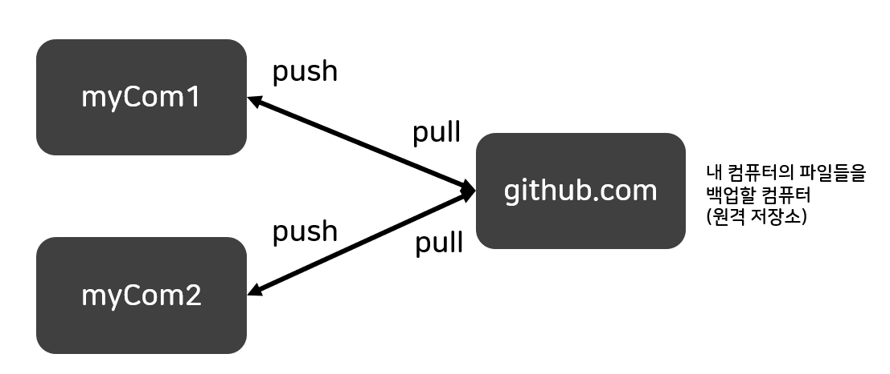
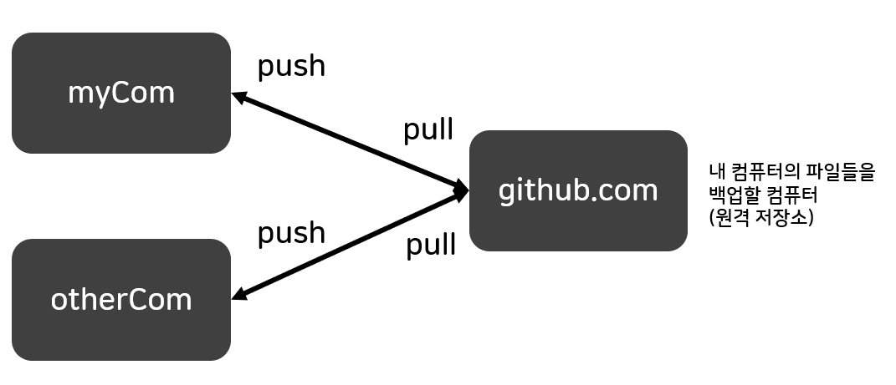

# git의 핵심목적

 git의 사용 목적은 아래와 같이 3가지 목적에 있다. 여기에서는 실습과는 별개로 git의 장점에 대해서만 알아본다. 

- version
- backup
- collaborate

## version

- git을 사용하지 않고 문서의 버전관리를 할 경우 파일 수정시 이전 내용으로 다시 돌아갈 경우가 생길 것을 위해 파일을 복사하여 관리하게 된다.

- 만약 하나의 파일 크기가 매우 크고 한 디렉터리에 파일의 갯수가 1000개가 넘는다고 가정하면 어떤 파일이 언제 수정되었고 무슨 내용이 수정되었는지 확인하기가 어려운 문제가 발생한다.

- 이러한 문제를 해결하기 위해 git으로 버전 관리를 한다. git은 수정 날짜, 메시지, 버전을 표시해주기 때문에 수정시 내용을 잘 표시해주고 변경시에 사용자에게 알려주므로 파일 관리에 이점이 있다. 

## backup

- 내 컴퓨터가 고장나면 그 안의 파일들은 유실될 수 있다. 그래서 백업이 필요하다.

- github.com의 컴퓨터에 내 파일들을 안전하게 (원격 저장소에) 저장

- 원격 저장소를 사용하므로써 다른 컴퓨터에서도 내 파일을 다운로드 받아(pull) 작업할 수 있다.

- 백업은 협업의 징검다리라고 할 수 있다.

## collaborate

- 이제 나 혼자 작업하는 것이 아닌 나와 다른 사람이 작업할 경우를 협업이라 하는데 중간에서 git이 발생할 수 있는 아래와 같은 문제들을 해결해준다.

- 두 사람이 같은 파일을 수정했을 경우 자동으로 합쳐주고, 같은 파일의 같은 행을 수정했을 경우 마지막으로 업로드 한 사람에게 처리하라고 알려주는 기능을 git을 해준다. 

- 이러한 문제들을 중간에서 git이 처리해준다.

