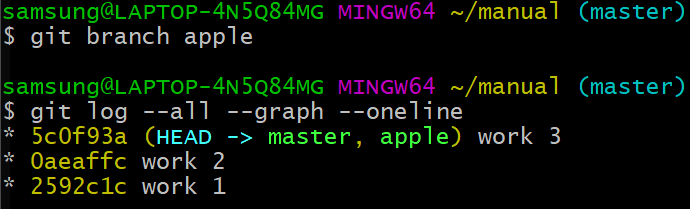

# branch & conflict1

branch는 가지라는 뜻으로 줄기에서 뻗어나오는 것을 가지라고 한다.

일을 하다보면 서로 다른 작업이 추가된 복제본이 필요할 때가 있다.

어떤 회사의 제품 사용설명서를 만드는 사람이라 가정하자, 설명서를 git으로 관리하고 있었지만 고객사가 없기 때문에 아무런 문제가 없었음.

제품을 만들고 나서 여러 고객사가 생기고 고객사마다 요구사항이 다 다름으로써 고객사마다 다른 기능을 납품하고 사용설명서도 달라진다. 즉, 문서를 여러 개 만들고 관리해야하는 어려움이 생김.

지금까지 저장소는 master라는 저장소를 사용했었지만 이제 master라는 저장소를 여러 개 복사하여 만든 다음 이제 각자의 저장소마다의 길을 가면된다.

하지만 아래의 그림을 보면 master에 있던 내용들은 다 같은 내용인데 서로 다른 디렉터리를 가지고 있기에 뭔가 비효율적으로 보인다.

또한 파일의 갯수가 1000개이상이고 파일의 크기가 클 경우 관리하기도 어려운 문제가 발생한다. 


버전관리를 하는 이유는 파일의 이름을 더럽히지 않고 버전관리할려고 사용하는데 고객사마다 디렉터리가 만들어지고 있고 디렉터리마다 이름을 더럽히고 있는 것이다.

구글에서 작업을 끝내고 보니까 애플에게도 필요한 내용일 경우 구글의 최신 상태 코드를 복사해서 애플에 저장소 디렉터리에 붙여넣기 하면 될 것이다. 그 결과를 합쳐서 새로운 버전을 만들면 될 것이다.

문제는 구글에서 작업했던 내용들은 애플 쪽으로 가지 않는다. 최신 버전만 복제한 것이기 때문에 과정은 유실되게 된다. 

또 코드를 병합하는 과정에서 생기는 문제들을 수동으로 처리해야 하는 문제가 발생한다.

이러한 문제들을 해결해주는 것을 `Branch`이다.

branch란 같은 뿌리에서 나왔지만 서로 다른 역사들을 써가고 있는 버전들을 말한다.


## Conflict

branch를 사용하면서 conflict가 일어난다.

#### 1. a.txt + b.txt = a.txt / b.txt

A라는 branch에 A.txt가 있고 B라는 branch에 B.txt가 있다고 하자, 둘을 합친다고 하면 git이 알아서 합쳐준다.


#### 2. a.txt + a.txt = a.txt 자동으로 생성

같은 파일인데 다른 부분을 수정했을 경우 git이 알아서 하나의 파일에 합쳐준다.


#### 3. conflict

하지만 같은 파일에서 같은 부분을 수정했다면 git이 병합을 중지시키고 사용자에게 이 부분은 충돌이 났기 때문에 수동으로 수정해달라고 요청해준다. 이러한 상황을 conflict라고 한다.


# branch & conflict2 실습준비

```bash
samsung@LAPTOP-4N5Q84MG MINGW64 ~/manual (master)
$ git log
commit 5c0f93a7903ca57b97b10bb28ea16e43100c796d (HEAD -> master)
Author: jeon <jeonchulmin@naver.com>
Date:   Fri Dec 27 18:14:55 2019 +0900

    work 3

commit 0aeaffc2a9b5f4f87e3cdd0bf151b23346e2af71
Author: jeon <jeonchulmin@naver.com>
Date:   Fri Dec 27 18:14:41 2019 +0900

    work 2

commit 2592c1cde68f83af97eebc29b6e037f0fadf3e16
Author: jeon <jeonchulmin@naver.com>
Date:   Fri Dec 27 18:13:54 2019 +0900

    work 1
```

이제 만일 여러 고객사가 생긴다고 가정하고 이 상황에 branch를 사용하지 않는다면 고객사마다 manual 디렉터리를 복사해서 만들어야 되는 문제점이 생긴다.


# Branch 기본 사용법

```bash
git log --all --graph --oneline
--all 모든 브랜치가 보임
--graph 시각적으로 표현
--oneline 버전과 메시지가 한 줄로 나옴
```


```bash
git branch
```

입력하면 master가 나옴, master는 아주 특별한 브랜치다.
저장소를 만들면 생성되는 기본 브랜치 master위에서 작업하고 있던 것이다.

master 앞 `*` 는 현재 master에 속해 있다는 것을 뜻함


```bash
git branch apple
```

apple이라는 브랜치 생성



```bash
git branch google
git branch ms
```

각각의 브랜치들은 master가 머물고 있는 상태에서 만들었기 때문에 work 3 상태 버전을 가지고 있는 상태이다.


```bash
nano work.txt
git commit -am "master work 4"
```


들어가서 마지막 줄에 master work 4 내용 추가 후 저장, 그 다음 commit.


작업한 것은 master이기 때문에 다른 branch들은 work 3에 머물러 있는 것을 볼 수 있다.


```bash
git checkout apple
```

apple branch로 가고 싶을 때, 즉 work 3 버전으로 돌아간다. work 3에는 master work 4가 없기 때문에, 위 명령어 실행 후에 work.txt에 master work 4 내용이 없는 것을 확인할 수 있다.


그리고 `HEAD ㅡ>` 는 현재 가리키는 것을 뜻하는 데 apple로 변경되어짐

master로 다시 돌아갈려면 `git checkout master` 명령어를 입력하면 된다.
