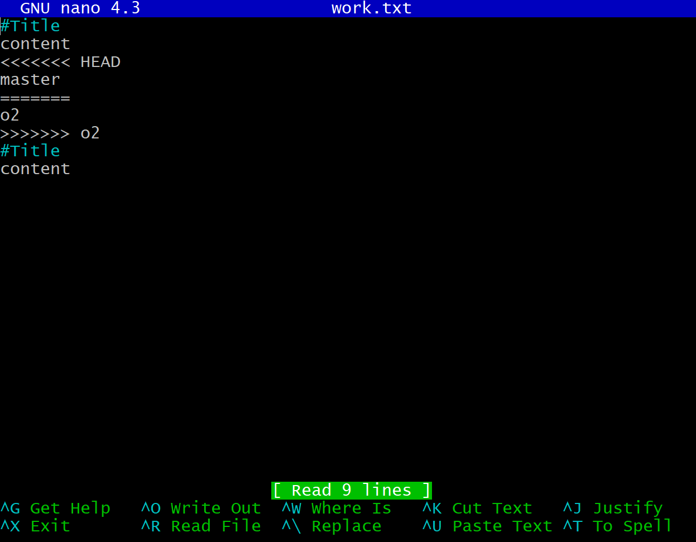

# 병합(merge)

## 1. merge 개념

merge는 무언가를 병합, 합친다는 뜻이다.

다른 branch에서 작업한 내용이 다른 branch에도 유용할 경우 둘의 내용을 합치는 작업(merge)이 필요하다.


합칠려는 버전의 공통 조상을 base라고 한다. 합쳐서 나온 버전은 병합된 버전이라는 뜻으로 merge commit이라고 한다.


merge를 하는 과정에서 수동으로 한다면 1000개의 파일의 코드를 수정한다고 가정하면 거의 불가능할 것이다. git은 대부분은 자동화해주고 논리적으로 자동화가 불가능할 경우 사용자에게 이 부분은 수정해달라기 때문에 편리하다.


## 2. 서로 다른 파일 merge

```bash
git init manual-merge
cd manual-merge

nano work.txt 
('1' 입력 후 저장)
git add work.txt
git commit -m "work 1"

git branch o2
(branch 삭제하고 싶을 경우에는 -d 옵션을 붙여줘서 입력하면 됨
ex)git branch -d o2 )
git l 
(= git log --all --graph --oneline)
```


```bash
nano master.txt 
('2' 입력 후 저장)
git add master.txt
git commit -m "work 2"
// commit message를 수정하고 싶을 경우
git commit --amend 
("master work 2" 수정 후 저장)
git l 
(= git log --all --graph --oneline)
```


```bash
git checkout o2
nano o2.txt 
(o2 2 입력 후 저장)
git add o2.txt
git commit -m "o2 work 2"
```


master branch에 o2 branch를 병합하고 싶다. 

즉, o2 branch 내용을 master 브랜치에 합치겠다는 의미이다.

맨 처음 master branch 상태가 되어야 한다.

```bash
git checkout master
```

그 다음 나의 현재(master) branch로 합치고 싶은 branch를 merge 명령어를 통해서 지정하면 된다.

```bash
git merge o2
//엔터 치면 새로운 버전이 왜 만들어졌는지에 대한 message 입력 editor가 나옴
```


이후에 새로운 버전이 생기고 이 버전은 o2의 최신 버전과 master의 이전 버전을 공통의 조상으로 함 


이전으로 돌아갈려면 master branch 내용을 취소해서 돌아가면 된다.

```bash
git reset --hard 돌아가고자 하는 버전
```


## 3. 같은 파일, 다른 부분 병합

```bash
git init manual-merge
cd manual-merge

nano work.txt
```

work.txt에 아래와 같은 내용 입력.

```
# title
content


# title
content
```


```bash
git add work.txt
git commit -m "1"
```


```bash
git branch o2
```


```bash
nano work.txt
```


```
# title
master content


# title
content
```


```bash
git commit -am "master work 2"
```


```bash
git checkout o2
nano work.txt
```


```
# title
content


# title
o2 content
```


```bash
git add work.txt
git commit -m "o2 work 2"
```


이제 o2 branch를 master branch에 합치기 위해 우선 master 상태로 가야한다.

```bash
git checkout master
git merge o2
cat work.txt
```


둘 다 적용된 work.txt가 만들어짐, git이 자동으로 해주는 기능. 즉, 같은 파일이라도 다른 부분을 수정했다면 git이 자동으로 합쳐준다.


## 4.같은 파일, 같은 부분 병합

두 개의 branch가 같은 파일을 수정했는데, 같은 부분을 수정했을 때 git이 자동으로 합치지 못한다. 이를 conflict라고 한다.

```bash
git init manual-merge
cd manual-merge
nano work.txt
```

work.txt에 아래와 같이 입력하면 된다.

```
#Title
content

#Title
content
```

```bash
git add work.txt
git commit -m "work 1"
git branch o2
```

이후 master에서의 work.txt를 아래와 같이 수정한다. 

```bash
nano work.txt
```

```
#Title
content
master
#Title
content
```

```bash
git commit -am "master work 2"
```


o2 branch에서도 master에서 수정한 부분과 동일한 위치에 o2를 입력한다.

```bash
git checkout o2
nano work.txt
```

```
#Title
content
o2
#Title
content
```

```bash
git add work.txt
git commit -m "o2 work 2"
```


o2 branch를 master branch에 merge하기 위해 먼저 master branch로 이동한다. 그 다음 merge 한다.

```bash
git checkout master
git merge o2
```


CONFLICT error 발생, 자동으로 merge하는 것을 실패했다고 나온다.

충돌을 해결한 다음에 다시 commit 하라고 알려준다.

git status를 보면 both modified라고 나온다.


```bash
nano work.txt
```



```
#Title
content
<<<<<<< HEAD // 현재 브랜치에서의 이 부분의 내용은 master
master
=======  // 구분자
o2 
>>>>>>> o2 // o2 브랜치에서 이 부분의 내용은 o2
#Title
content
```

직접 같은 부분 내용을 아래와 같이 수정해준다.

```
#Title
content
master, o2
#Title
content
```


```bash
git add work.txt
git status
```


```bash
git commit
자동으로 merge editor 나오고 merge 된다.
```


# 3 way merge

충돌이라는 것은 branch와 branch를 병합할 때, 협업할 때 충돌이 일어난다.

깃은 어떻게 충돌을 어떻게 파악하고, 어떻게 두 개의 브랜치를 병합했을 때 자동으로 병합해주는 것과 수동으로 병합해주는 부분은 어떻게 구분할까를 알아본다.

여기서는 원리만을 알아본다.


### 1. 두 개의 branch(here, there를 생성)


### 2. here, there 2개의 branch를 merge 했을 경우 생기는 문제

A를 제외하고 나머지는 내용이 다르기 때문에 어떤 내용을 합칠 지 모른다.


### 3. 3 way merge를 통해 git이 어떻게 합치는 지 알아본다.

base를 기준으로 무엇이 바뀌었는지 확인을 통해 합친다.


### 3-1. 맨 아래 줄은 base를 기준으로 2 개의 branch 다 내용이 변경되었으므로 git은 이 경우 사용자에게 직접 수정해달라고 요청한다.


### 3-2. 2 번째 줄은 base를 기준으로 there branch는 수정되지 않았고 here에서만 수정되었기 때문에 수정된 내용을 merge한다.


### 3-3. 3 번째 줄 또한 base를 기준으로 there branch 내용만 수정되었기 때문에 수정된 내용을 merge한다.


결론적으로는 base를 기준으로 최신 수정된 것을 git이 자동으로 합치고 이외 경우에는 사용자에게 직접 수정해달라고 요청한다. 

3 way merge를 사용했을 때 2 way merge를 사용했을 때보다 더 많은 내용을 자동적으로  merge 해줄 수 있다.