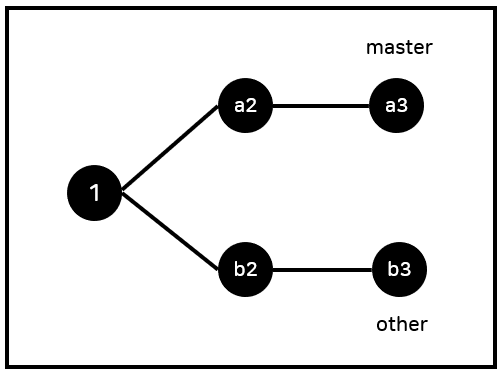
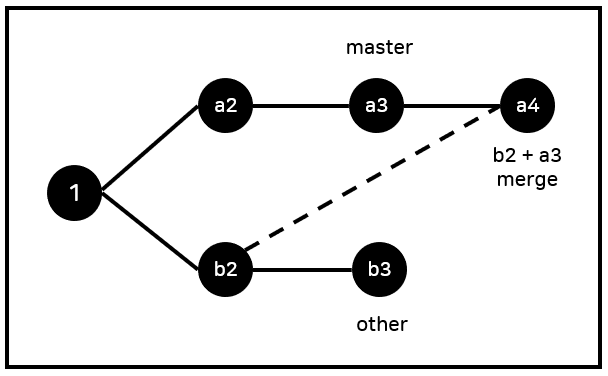
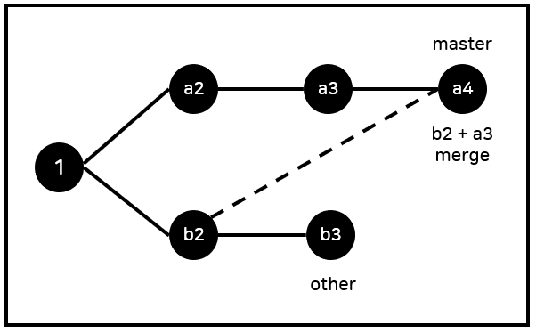
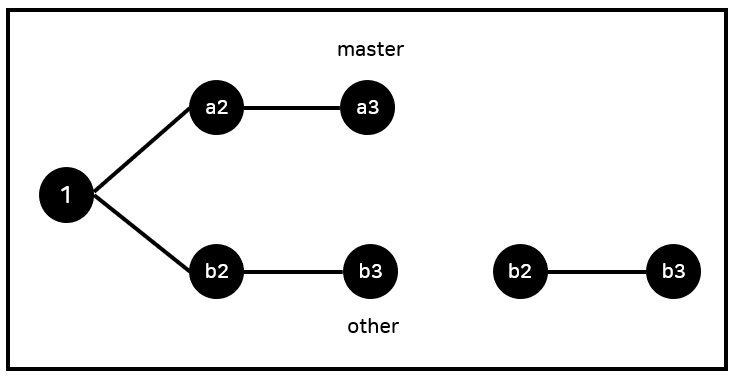
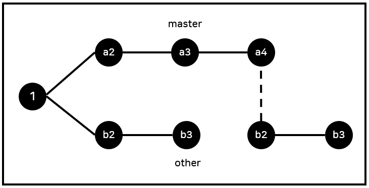
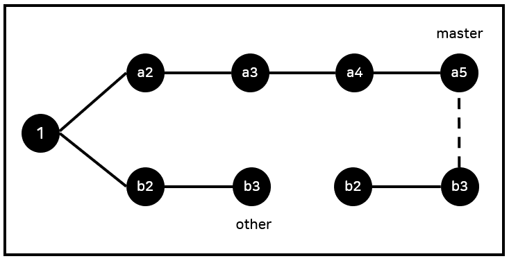

# 추가 내용

## git workflow

- git workflow로 검색, 여러 사례 중에 git flow를 찾아보면 개발자들에게 채택된 모범사례를 볼 수 있다.
- 더 많은 사람의 정한 규칙이 장점, 협업시 이미 유명한 사례를 적용시켜 하고 있는 경우가 많기 때문에, 업무에 빨리 집중할 수 있게 해준다.


## cherry-pick

- 모든 변경사항을 적용하는 것이 아니라 b2의 변경사항만 적용하고 싶을 경우











## rebase

- rebase는 merge와 목표은 같으나 사용시 타임라인을 더 깔끔하게 유지시켜준다.
- b2, b3의 base를 master branch로 바꾸는 것이다. 

#### 1. 우선 b2, b3를 옮겨 놓다음



#### 2. 순차적으로 a3 + b2 = a4



#### 3. 그 다음 a4 + b3 = a5



other에서 작업한 내용의 base 가 1이었는데 a3로 새롭게 달라지기 때문에 병합한 효과를 내면서도 timeline이 깔끔하게 유지된다는 장점이 있다.


# 추가 Tip

### git l 처럼 명령어 단축 설정하는 법

1) nano ~/.gitconfig 명령어를 입력해서 editor를 연다.

2) 아래 내용을 입력하면, git l 단축명령어를 사용할 수 있습니다.

```
[alias]
	l = log --all --graph --oneline
```