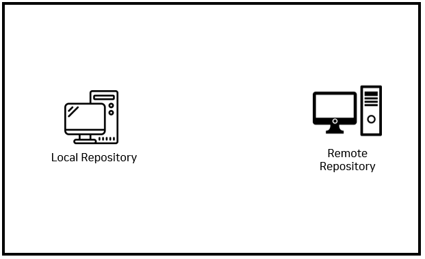

# backup 용어 정리(push, pull, clone)

 backup을 하기위해서는 내 컴퓨터와 내 컴퓨터가 고장날 경우를 대비해 파일들을 업로드 해놓은 컴퓨터, 최소 2대는 있어야 한다.

 왼쪽에 있는 컴퓨터를 자기 집에서 작업하는 컴퓨터라고 가정하자, 그 컴퓨터를 보통 지역 저장소, local repository라고 부른다. 지역 저장소에서 작업을 끝낸 버전들을 업로드해서 지역 저장소와 똑같은 상태를 유지하는 컴퓨터에 설치되어 있는 저장소를 원격 저장소, remoete repository라고 한다.

 backup 컴퓨터로 업로드하는 것을 `push`라고 하는데, push를 하게되면 지역저장소에 있는 문서, 버전이 원격 저장소를 업로드 되는 것이다. 그래서 작업이 끝날 때마다 push를 해줘서 두 컴퓨터가 같은 상태를 유지할 수 있도록 한다.

 이 backup이라는 것은 복원도 할 수 있어야 한다, 예를 들어 집에서 작업하는 컴퓨터와 회사에서 작업하는 컴퓨터가 있다고 하자. 회사 컴퓨터 또한 이전에 작업한 내용을 필요로 하기 때문에 원격 저장소에 있는 내용을 회사에 있는 지역 저장소에 복제를 하면된다. 복제를 하는 과정을 `clone`이라고 한다. 원격 저장소와 회사 지역 저장소가 같은 상태가 될 것이다.

 회사 지역 저장소에서 작업 후 버전을 만들고 push를 하면, 회사의 컴퓨터와 원격 저장소는 같은 상태를 유지할 것이다. 하지만 집 컴와 회사, 원격 저장소는 상태가 다를 것이다.

집 컴으로 처리할 일이 생겼을 경우 원격 저장소에서 지역 저장소를 버전을 다운로드하면 이 3개의 저장소가 완전히 똑같은 상태가 된다. git에서는 다운로드라는 표현보다 pull이라는 표현을 쓴다. 

 집에서 작업을 끝내고 다시 원격 저장소로 push, 회사에서는 최신 작업한 내용을 pull(다운로드)해서 작업하면된다.

pull, push를 반복해서 장소에 상관없이 안전하게 작업을 할 수 있다. 이것이 git backup의 이점이라 할 수 있다. 그렇다면 백업을 하기 위해서 중심에 있는 것이 Remote Repository이다.

이를 위해서는 원격 저장소를 마련해야 한다. 직접 마련하는 것을 어렵기 때문에 이를 제공해주는 서비스를 이용할 것인데 이러한 서비스를 `git hosting`이라고 한다.