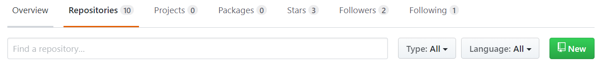
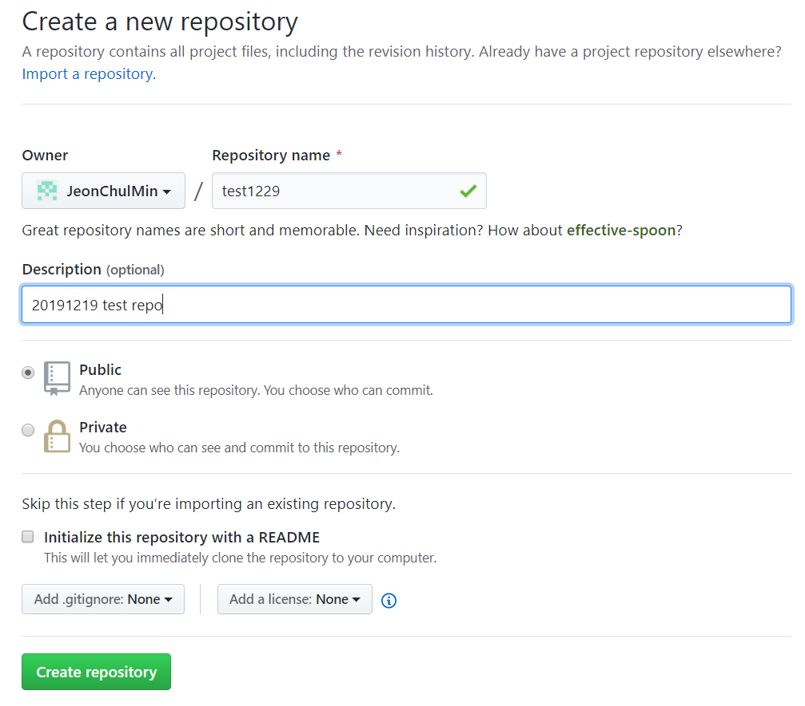
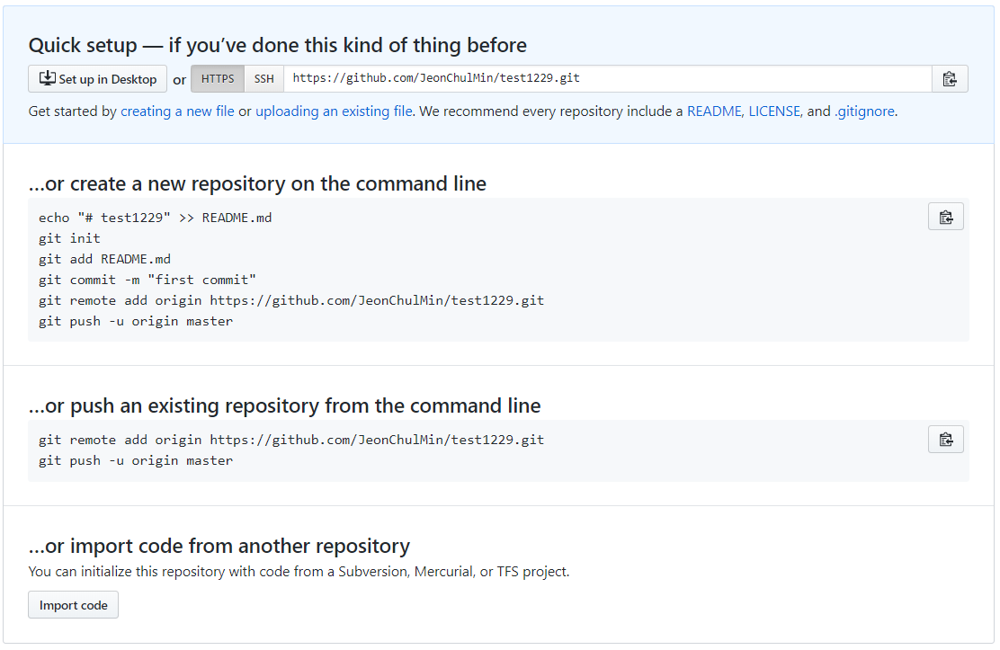

# 원격저장소 생성

1. github.com에 로그인
2. repository category로 이동하여 new 버튼 클릭

3. repository 이름과 설명을 입력하고 public 선택하고 Create repository를 클릭한다.

- public이란 모두에게 공개한다는 뜻이고 private는 혼자 및 일정 수의 팀원 간만 사용할 수 있는 옵션이다.
- Initialize this repository with a README 옵션은 해당 repository에 들어갈 경우 설명할 수 있는 설명 파일이라고 생각하면 될 것 같다. 크게 중요하지 않으니 나중에 설정해서 할 수도 있다.

4. 아래와 같은 창이 뜨면 원격 저장소가 정상적으로 만들어진 것이다.

