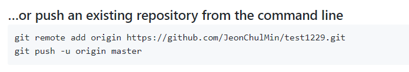
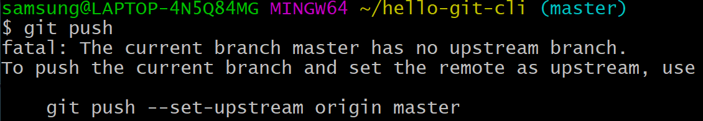
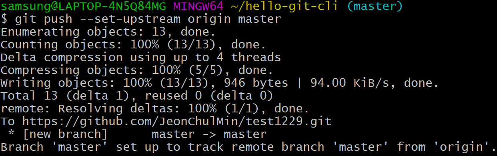
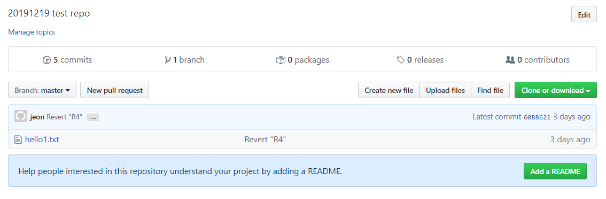

# 원격 저장소와 지역 저장소 연결

- 저장소끼리 작업 내용(버전)을 주고 받기 위해서 통신이 필요하다.

|                  | Local Repository > Remote Repository | Remote Repository >  Local Repository |
| :--------------: | :----------------------------------: | :-----------------------------------: |
| **http / https** |               보안 Bad               |            배울 것이 없음             |
|     **ssh**      |              보안 Good               |            배울 것이 많음             |

- 여기서는 http를 사용해서 Local Repository > Remote Repository, Remote Repository >  Local Repository 주고 받는 법을 배운다. 


### 1. 지역 저장소 디렉터리로 들어간다.

```bash
cd test_1229
```


### 2. github.com에 들어가서 연결하고자 하는 원격 저장소로 들어간다.

- 원격 저장소가 있을 경우 아래 command line 방법으로 연결할 수 있다고 나와있다. 아래 명령어를 복사해서 git bash에 붙여넣기 해서 연결 가능하다. 



```bash
git remote add origin https://github.com/JeonChulMin/test1229.git
git push -u origin master
```

- git의 명령어 중에 원격 저장소와 관련된 명령어는 remote이다. 

- 뒤에 있는 주소는 원격 저장소를 뜻한다.

- 주소를 넣을 때에는 github.com에서 HTTPS 체크되어있는 주소를 넣어야 한다.

```bash
git remote add origin https://github.com/JeonChulMin/test1229.git
```

- 이 명령어 한 줄이 이 지역 저장소와 원격 저장소를 연결시킨 것이다.

- git 사용시 원격 저장소를 많이 사용하는데 매번 원격 저장소의 주소를 기억할 수도 없고 원격 저장소는 여러 개의 지역 저장소와 연결되어 있기 때문에 경우에 따라 각각의 원격 저장소에 별명을 붙여서 구별해서 사용하기도 한다.

- 보통 기본적인 원격 저장소는 `origin`이라는 이름을 쓰는 관습이 있어서 origin이라 입력한다.

```bash
git remote add "별명" 주소
git remote add origin 주소
```


### 3. 지역 저장소와 원격 저장소가 연결되었는지 확인

```bash
git remote 명령어로 지역과 원격 연결된 별명, 이름 볼 수 잇따.
git remote -v 원격 저장소 주소로 볼 수 있다.
```


# git push

- 지역 저장소의 버전을 원격 저장소로 업로드하는 방법인 push를 알아본다.

```bash
git push
```



- git push 명령어를 실행하면 위와 같은 error가 발생하는데, 이 지역 저장소는 여러 개의 원격 저장소와 연결되어질 수 있는데 어떤 원격 저장소를 기본으로 연결할 것인지 설정하라는 문구이다.
- 이거는 딱 한번만 설정하면되어서 error문장을 복사해서 입력하면 된다.


```bash
git push --set-upstream origin master
```

- 위 명령어를 해석하면 `git push`라고만 입력하면 origin에 master branch로 업로드된다고 생각하면 된다.

- 맨 처음할 경우 id, pwd를 입력하라고 한다. github 계정을 입력하면 된다.
- 입력 후 아래와 같이 나오면 성공.




- 원격 저장소 페이지를 새로고침하면 지역 저장소의 파일이 올라간 것을 확인할 수 있다.



- 이 방법으로 이제 작업한 내용을 버전으로 만들고 push를 반복해서 원격 저장소에 backup이 가능하다, 이를 통해 협업할 수 있는 것이다.


# git clone

- 원격 저장소를 복제하여 지역 저장소를 만드는 방법을 알아본다.

- 새 컴퓨터에 지금까지 작업했던 것을 가져와서 작업해야할 때 복원하는 방법을 살펴본다.

- 복원을 할 수 있으면 여러 컴퓨터에 같은 작업을 유지할 수 있고 이동하면서 작업하는 데 편리함을 준다.

```bash
git clone https://github.com/JeonChulMin/test1229.git
```

- 현재 이 명령을 실행시킨 디렉터리에 test1229가 디렉터리가 생성되도록 약속되어 있다.
- "repository 이름".git, repository 이름이 디렉터리로 생성되어 내용들이 그 안에 들어가서 다운로드되어 진다.

- 다른 디렉터리를 만들고 싶다면 아래와 같이 명령어 뒤에 디렉터리명을 붙여주면 된다.

```bash
git clone https://github.com/JeonChulMin/test1229.git "디렉터리명"
```


# git pull

- 원격 저장소의 버전을 지역 저장소로 가져오는 방법인 pull 명령어를 알아본다.
- 연결된 원격 저장소를 확인한다.

```bash
git remote -v
git pull
```


### 예제

- 다른 저장소에서 hello1.txt 수정

```bash
nano hello1.txt
(backup2 내용 추가)
git add hello1.txt
git commit -m "backup 2"
git push
```

- 또 다른 저장소로 이동해서 작업을 새로할려면 원격 저장소를 지역 저장소에 동기화시켜야 한다.

```bash
git pull
```

